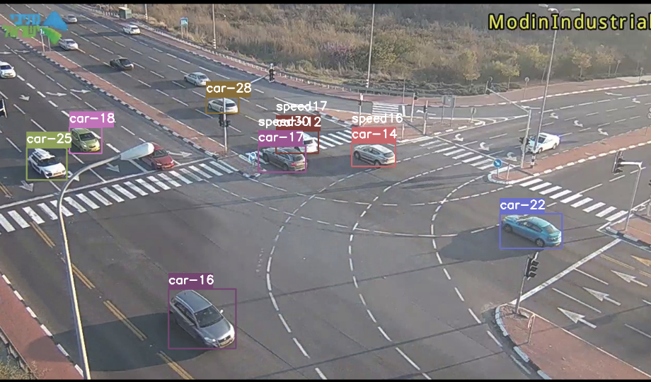
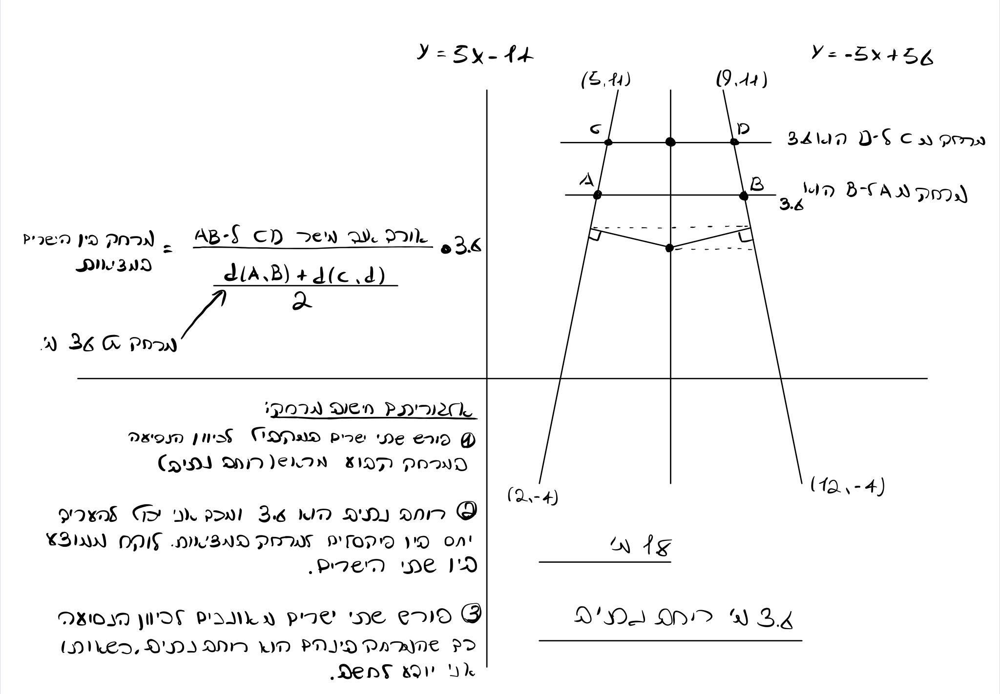
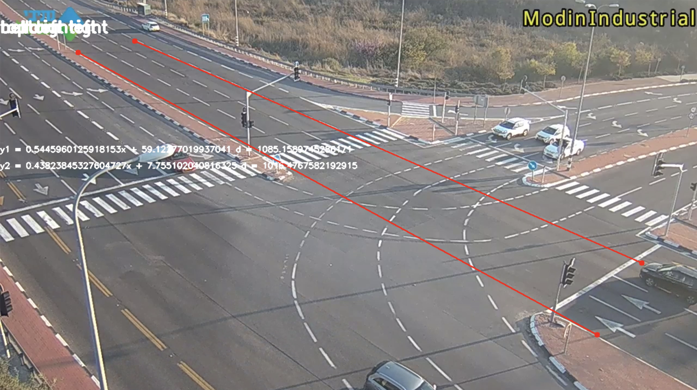
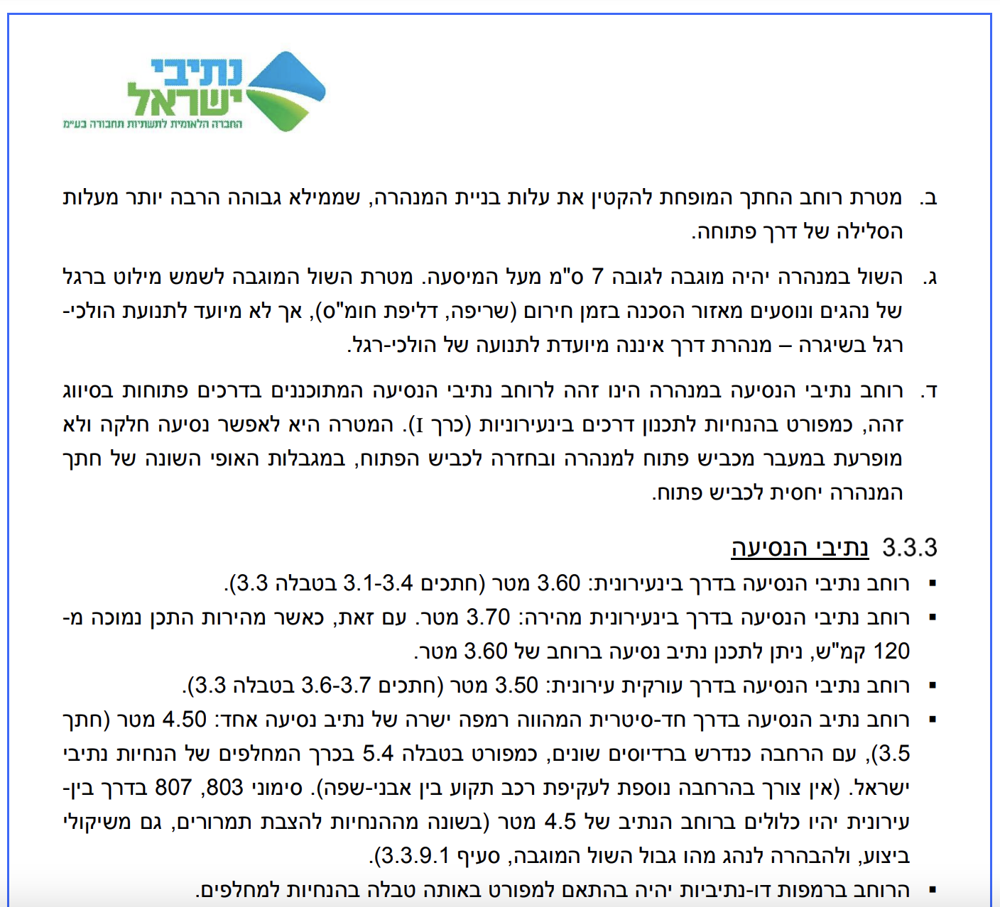

# Speed-Cam

## Car detection in an Intersection   
Using YoloV4 and DeepSort to Recognise cars and create bounding boxes.  
Using two linear equations in order to create two lines with known Distance between them.   
and inference the speed from the time that it takes to cross that distance.  
also counting the number of cars going through the intersection.  
The speed is currently calculated for the right part of the intersection.

## why Yolo and DeepSort?  
No specific reason, just getting to know this kind of model.  
Probably can be simplified using optical-flow or other computer vision techniques.    
Yolo and DeepSort is computational expensive.

## Yolo and DeepSort implementation   
Used pre-trained weights from https://github.com/AlexeyAB/darknet.  
The weights where converted to tensorflow weights. Alternating between Yolo tiny-416 
and Yolo-512.
The DeepSort algorithm is from https://github.com/nwojke/deep_sort. 
ipad.jpeg
## Speed inference

## Research

Lane width is ~3.60. 

