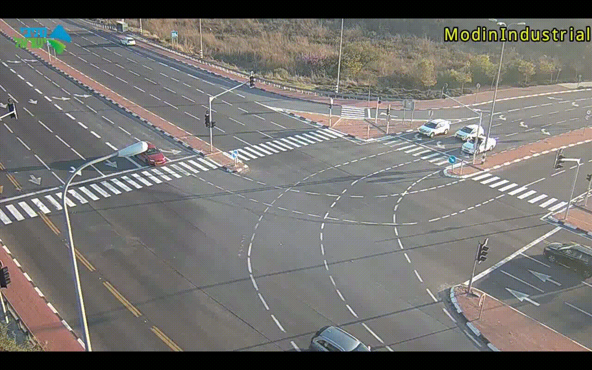

# Speed-Cam
"source": [
        ""
      ]

## Car detection in a Intersection   
Using YoloV4 and DeepSort to Recognise cars and create bounding boxes.  
Using two linear equations in order to create two lines with known Distence between them.   
and infrence the speed from the time that it takes to cross that distance.  
also counting the number of cars going throu the intersection.  
The speed is currently calculated for the right part of the intersection.

## why Yolo and DeepSort?  
No specific reason, just getting to know this kind of model.  
Probably can be simplefid using optical-flow or other computer vision techniques.    
Yolo and DeepSort is computational expensive.

## Yolo and DeepSort implemention   
Used pre-trained weights from https://github.com/AlexeyAB/darknet.  
The weights where converted to tesnorflow weights. Alternating between Yolo tiny-416 
and Yolo-512.
The DeepSort algorithm is from https://github.com/nwojke/deep_sort. 

## Speed inference   
Took the video of the Intersection, and picked a car, looked for the length of the exact car model  
and from that i got two points that i know the distance between.  
i took two lines that are vertical to the driving direction using opencv (video_cord.py)  
and found linear equations for them. then for every car in that going through the intersection,  
i could calculate how much time it takes that car to cover a specific disatnce.

